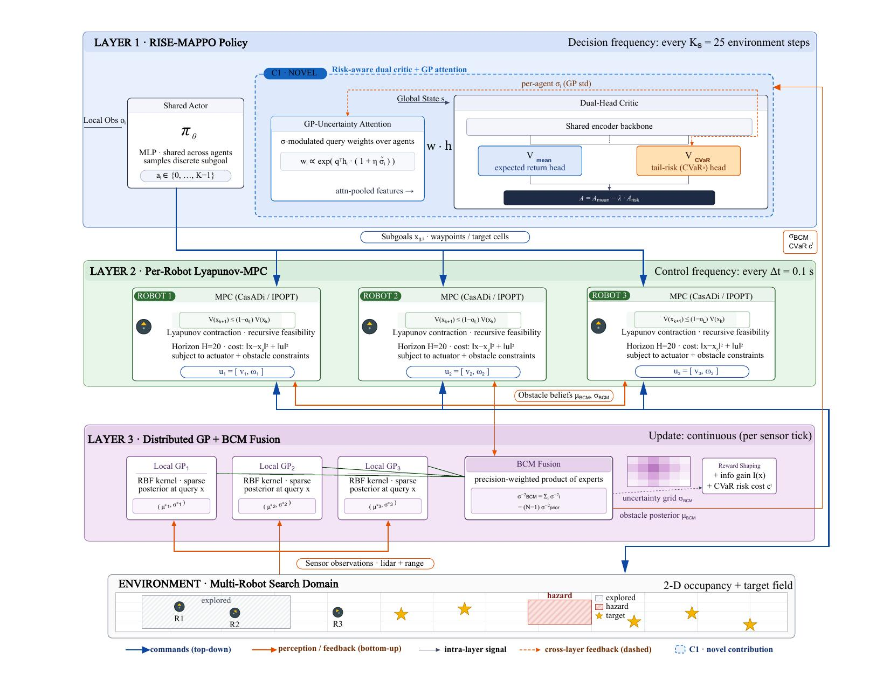

# RISE-MAPPO

**Risk-Sensitive Multi-Agent Policy Optimization for Multi-Robot Exploration**

[](https://www.python.org/)
[](https://pytorch.org/)
[](LICENSE)

A hierarchical framework coupling risk-sensitive multi-agent reinforcement learning with model-based control for cooperative robotic search in unknown environments.

<p align="center">
  
</p>

---

## Overview

RISE-MAPPO addresses the problem of deploying teams of mobile robots to cooperatively search unknown or hazardous environments. The framework introduces three key innovations:

1. **Dual-Head CVaR Critic** — A centralized critic that simultaneously estimates expected returns (*V*_mean) and conditional value-at-risk (*V*_CVaR), producing a risk-adjusted advantage *A = A*_mean *− λ · A*_risk that makes the joint policy inherently risk-averse.

2. **GP-Uncertainty-Weighted Attention** — An attention mechanism in the critic that modulates agent-level feature aggregation by Gaussian process posterior variance, directing representational focus toward agents in poorly explored regions.

3. **Hierarchical Control Architecture** — RISE-MAPPO (high-level planner) → Lyapunov-stable MPC (low-level tracking) → Distributed GP with BCM fusion (perception), providing kinodynamic feasibility and provable tracking stability.

## Architecture

```
┌──────────────────────────────────────────────────────┐
│  RISE-MAPPO Policy (every Kₛ = 25 steps)             │
│                                                       │
│  Actor πθ  →  GP-Uncertainty Attention  →  Dual-Head  │
│               wᵢ ∝ exp(qᵀhᵢ·(1+ησ̃ᵢ))     Critic    │
│                                           ┌───┐┌───┐ │
│                                           │V_m││V_c│ │
│                                           └─┬─┘└─┬─┘ │
│                                         A = Am - λ·Ar │
└───────────────────────┬──────────────────────────────┘
                        │ Subgoals
┌───────────────────────▼──────────────────────────────┐
│  Per-Robot Lyapunov-MPC (every Δt = 0.1s)            │
│                                                       │
│  ┌─────────┐  ┌─────────┐  ┌─────────┐              │
│  │ MPC₁    │  │ MPC₂    │  │ MPC₃    │  CasADi/IPOPT│
│  │V(k+1)≤  │  │V(k+1)≤  │  │V(k+1)≤  │              │
│  │(1-α)V(k)│  │(1-α)V(k)│  │(1-α)V(k)│              │
│  └────┬────┘  └────┬────┘  └────┬────┘              │
└───────┼─────────────┼───────────┼────────────────────┘
        │ Controls    │           │       ▲ Obstacles
┌───────▼─────────────▼───────────▼───────┼────────────┐
│  Distributed GP + BCM Fusion (continuous)            │
│                                                       │
│  GP₁  GP₂  GP₃  →  BCM Fusion → σ_BCM, CVaR cᵗ     │
│  σ⁻²_BCM = Σσᵢ⁻² − (N−1)σ⁻²_prior                  │
└──────────────────────────────────────────────────────┘
```

## Project Structure

```
RISE-MAPPO/
├── configs/                    # YAML configuration files
│   ├── default.yaml            # Full RISE-MAPPO config
│   ├── ablation_no_rise.yaml   # MAPPO-only (no RISE modules)
│   ├── ablation_no_attention.yaml  # No GP-uncertainty attention
│   ├── ablation_no_cvar_head.yaml  # No CVaR dual-head
│   ├── eval_default.yaml       # Evaluation settings
│   └── scenario_*.yaml         # 5 evaluation scenarios
├── envs/                       # Multi-robot search environment
│   └── multi_robot_search_env.py
├── marl/mappo/                 # RISE-MAPPO algorithm
│   ├── actor.py                # Shared decentralized actor
│   ├── critic.py               # Dual-head CVaR critic + GP attention
│   ├── algorithm.py            # PPO update with risk-adjusted advantage
│   ├── buffer.py               # Rollout storage
│   └── runner.py               # Training loop
├── mpc/                        # Low-level control
│   └── lyapunov_mpc.py         # CasADi/IPOPT Lyapunov-stable MPC
├── gp/                         # Perception layer
│   └── distributed_gp.py       # Sparse GP + BCM fusion + CVaR
├── baselines/                  # Evaluation baselines
│   ├── base_policy.py          # Abstract policy interface
│   ├── random_policy.py        # Random subgoal selection
│   ├── nearest_frontier.py     # Yamauchi (1997) frontier-based
│   ├── voronoi_partition.py    # Voronoi-based area partition
│   └── trained_policy.py       # Wrapper for trained checkpoints
├── analysis/                   # Evaluation and visualization
│   ├── metrics.py              # 10 evaluation metrics
│   └── plotting.py             # IEEE publication-quality figures
├── scripts/                    # Entry points
│   ├── train.py                # Training script
│   ├── evaluate.py             # Evaluation pipeline
│   ├── run_single.sh           # Single training run launcher
│   ├── run_all_seeds.sh        # Multi-seed batch launcher
│   ├── check_status.py         # Training status dashboard
│   └── collect_results.py      # Log parser → CSV
├── tests/                      # Test suite (78 tests)
│   ├── test_env.py
│   ├── test_mappo.py
│   ├── test_mpc.py
│   ├── test_gp.py
│   ├── test_rise_modules.py
│   ├── test_metrics.py
│   ├── test_baselines.py
│   └── test_evaluate.py
├── paper/                      # LaTeX manuscript
│   ├── main.tex
│   └── fig/
├── docs/                       # Documentation
│   ├── ARCHITECTURE.md
│   ├── CONTRIBUTIONS.md
│   ├── TRAINING.md
│   └── EVALUATION.md
└── results/                    # Outputs (gitignored)
    ├── checkpoints/
    ├── runs/
    └── eval/
```

## Installation

**Requirements:** Python 3.10, CUDA-capable GPU (tested on RTX 2080 Ti)

```bash
git clone https://github.com/Lucifer-121-cmd/RISE-MAPPO.git
cd RISE-MAPPO
python -m venv .venv
source .venv/bin/activate
pip install -r requirements.txt
pip install -e .
```

### Dependencies

| Package | Version | Purpose |
|---------|---------|---------|
| PyTorch | ≥ 2.0 | Neural networks, GPU training |
| CasADi | ≥ 3.6 | NLP formulation for MPC |
| GPyTorch | ≥ 1.11 | Sparse Gaussian processes |
| Gymnasium | ≥ 0.29 | Environment interface |
| NumPy / SciPy | ≥ 1.24 / 1.10 | Numerical computation |
| Matplotlib | ≥ 3.7 | Plotting |

## Quick Start

### Run tests
```bash
python -m pytest tests/ -v    # 78 tests, all should pass
```

### Smoke training (2 updates, CPU)
```bash
python scripts/train.py --config configs/default.yaml --seed 42 --smoke
```

### Full training (single seed)
```bash
python scripts/train.py --config configs/default.yaml --seed 42 --device cuda
```

### Multi-seed training (parallel on 2 GPUs)
```bash
# Dry run to verify plan
./scripts/run_all_seeds.sh --parallel --dry-run

# Launch (inside tmux)
tmux new -s batch
./scripts/run_all_seeds.sh --parallel 2>&1 | tee batch_run.log
```

### Monitor training
```bash
python scripts/check_status.py --watch 300
```

### Evaluate a trained policy
```bash
python scripts/evaluate.py \
    --policy trained \
    --checkpoint results/runs/full_seed42/checkpoints/mappo_upd1000.pt \
    --config configs/default.yaml \
    --scenario configs/scenario_complex.yaml \
    --eval-config configs/eval_default.yaml
```

### Evaluate a baseline
```bash
python scripts/evaluate.py \
    --policy nearest_frontier \
    --scenario configs/scenario_complex.yaml \
    --eval-config configs/eval_default.yaml
```

## Key Hyperparameters

| Parameter | Symbol | Value | Description |
|-----------|--------|-------|-------------|
| Risk penalty weight | λ_risk | 0.05 | Risk–return trade-off |
| CVaR head loss weight | β | 0.25 | Relative weight of CVaR critic head |
| GP attention temperature | η | 0.5 | Strength of uncertainty modulation |
| CVaR confidence level | α | 0.05 | Tail probability for risk |
| Lyapunov contraction rate | α_L | 0.1 | MPC tracking convergence rate |
| MPC horizon | H | 20 | Prediction steps |
| Subgoal interval | K_s | 25 | Low-level steps per decision |
| Max gradient norm | — | 0.5 | Gradient clipping |
| Discount factor | γ | 0.99 | Return discounting |
| GAE parameter | λ | 0.95 | Advantage estimation |

## Evaluation Metrics

| Metric | Description | Better |
|--------|-------------|--------|
| Coverage Rate | Fraction of area explored | Higher |
| Detection Success | Fraction of targets found | Higher |
| Collision Rate | Total collisions per episode | Lower |
| Energy Efficiency | Coverage per unit energy | Higher |
| Mean CVaR Risk | Average tail risk encountered | Lower |
| Exploration Overlap | Cells visited by >1 robot | Lower |
| Lyapunov Stability | Fraction of monotonically decreasing V(t) | Higher |

## Baselines

| Method | Type | Description |
|--------|------|-------------|
| Random | Non-learning | Uniform random subgoal selection |
| Nearest Frontier | Classical | Yamauchi (1997), greedy nearest frontier |
| Voronoi Partition | Classical | Voronoi-based area partitioning |
| MAPPO | Ablation | Standard MAPPO without RISE modules |
| Ours w/o CVaR | Ablation | λ_risk = 0, β = 0 |
| Ours w/o GP-Attn | Ablation | η = 0 |

## Robot Platform

TurtleBot3 Burger with unicycle kinematics:
- Max linear velocity: 0.22 m/s
- Max angular velocity: 2.84 rad/s
- Sensor range: 1.5 m
- Differential drive model

## Development Status

| Phase | Description | Status |
|-------|-------------|--------|
| Phase 1 | Environment + MAPPO + pipeline | ✅ Done (59 tests) |
| Phase 2 | Lyapunov-MPC + GP + CVaR integration | ✅ Done (51 tests) |
| Phase 2.5 | RISE-MAPPO novel modules (dual-head, GP-attention) | ✅ Done (58 tests) |
| Phase 3 | Evaluation pipeline + baselines | ✅ Done (19 tests) |
| Phase 4 | Multi-seed training + experiments | 🔄 In progress |

## Citation

```bibtex
@article{dhakal2026rise,
  title={{RISE-MAPPO}: Risk-Sensitive Multi-Agent Policy Optimization 
         for Multi-Robot Exploration},
  author={Dhakal, Nischal and {Shuaiyong Li}},
  journal={submitted to IEEE Robotics and Automation Letters},
  year={2026}
}
```

## License

This project is for academic research. Please cite our work if you use this codebase.
